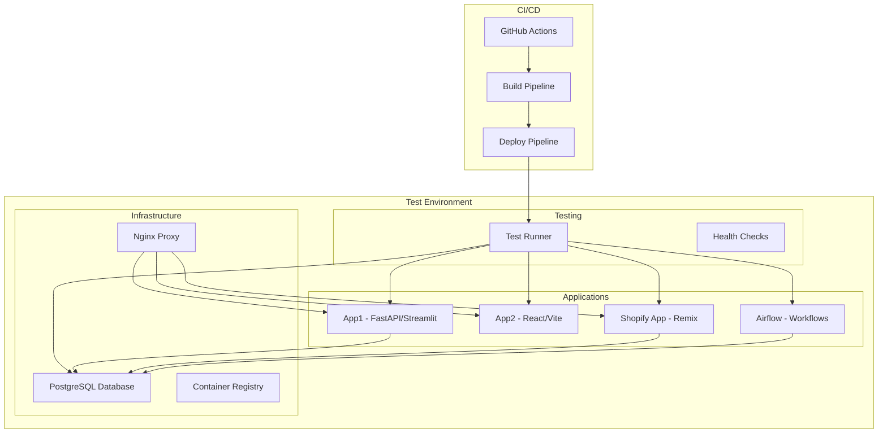

# Testing Guide

This guide provides comprehensive instructions for using the test environment to validate your release cycle.

## Overview

The test environment simulates your entire production deployment pipeline with mock services that behave like real applications. This allows you to:

- Test deployment workflows without affecting production
- Validate configuration changes safely
- Debug deployment issues in isolation
- Ensure new features work in a production-like environment

## Test Environment Architecture



## Getting Started

### Step 1: Verify Prerequisites

```bash
cd test-environment
./scripts/verify-setup.sh
```

This checks:
- Docker and Docker Compose installation
- Port availability
- System resources
- Configuration validity

### Step 2: Setup Test Environment

```bash
./scripts/setup-test-environment.sh
```

This will:
- Build all Docker images
- Start all services
- Initialize databases with test data
- Configure networking
- Run initial health checks

### Step 3: Run Tests

```bash
./scripts/run-tests.sh
```

Or run specific test categories:

```bash
./scripts/run-tests.sh services    # Service health tests
./scripts/run-tests.sh workflow    # Release workflow tests
./scripts/run-tests.sh all         # All tests
```

### Step 4: Manual Testing (Optional)

Access services directly:
- App1: http://localhost:8001 (API) / http://localhost:8501 (Streamlit)
- App2: http://localhost:3000
- Shopify App: http://localhost:3001
- Airflow: http://localhost:8082 (admin/admin)

### Step 5: Cleanup

```bash
./scripts/cleanup.sh
```

## Test Categories

### 1. Service Health Tests

**Purpose**: Verify all services are running and responding correctly

**Tests Include**:
- Basic health check endpoints
- Database connectivity
- Service-to-service communication
- Configuration validation

**Run Command**:
```bash
./scripts/run-tests.sh services
```

### 2. Release Workflow Tests

**Purpose**: Test the complete deployment pipeline

**Tests Include**:
- End-to-end deployment simulation
- Build process validation
- Database migration testing
- Error handling and rollback scenarios

**Run Command**:
```bash
./scripts/run-tests.sh workflow
```

### 3. Integration Tests

**Purpose**: Test interactions between services

**Tests Include**:
- API communication
- Database transactions
- Proxy routing
- Authentication flows

**Run Command**:
```bash
docker-compose run --rm test-runner pytest tests/test_services.py::TestServiceIntegration -v
```

## GitHub Actions Integration

### Workflow Triggers

The test environment integrates with GitHub Actions through the `test-release.yml` workflow:

1. **Manual Trigger**: Actions → Test Release Environment → Run workflow
2. **Pull Request**: Automatic testing on PR to main/develop
3. **Push**: Automatic testing on push to main branch

### Test Configuration

When manually triggering the workflow, you can configure:

- **Test Type**: all, services, workflow, performance
- **Environment**: test, staging-simulation, production-simulation

### Workflow Results

The workflow produces:
- Test reports for each category
- Performance metrics
- Service health status
- Deployment simulation results

## Advanced Usage

### Custom Test Data

To add custom test data:

1. Edit `fixtures/postgres/02-seed-data.sql`
2. Restart the test environment
3. Run tests to verify changes

### Adding New Tests

1. Create test files in `tests/` directory
2. Use existing fixtures from `conftest.py`
3. Follow pytest conventions
4. Update this guide with new test categories

### Performance Testing

Run performance tests with:

```bash
docker-compose run --rm test-runner pytest tests/test_performance.py -v
```

### Debug Mode

For debugging test failures:

```bash
# Run specific test with verbose output
docker-compose run --rm test-runner pytest tests/test_services.py::TestServiceHealth::test_app1_health -v -s

# Access service logs
docker-compose logs test-app1

# Execute commands in containers
docker-compose exec test-app1 bash
```

## Test Scenarios

### Scenario 1: New Feature Deployment

**Objective**: Test deployment of a new feature

**Steps**:
1. Modify mock service code to simulate new feature
2. Run full test suite
3. Verify feature works correctly
4. Check database migrations if applicable

### Scenario 2: Configuration Changes

**Objective**: Test configuration updates

**Steps**:
1. Update service configuration files
2. Restart affected services
3. Run integration tests
4. Verify configuration is applied correctly

### Scenario 3: Database Schema Changes

**Objective**: Test database migrations

**Steps**:
1. Update database fixtures
2. Run migration tests
3. Verify data integrity
4. Test rollback scenarios

### Scenario 4: Service Failure Recovery

**Objective**: Test error handling and recovery

**Steps**:
1. Simulate service failures
2. Verify error handling
3. Test automatic recovery
4. Validate monitoring and alerting

## Troubleshooting

### Common Issues

1. **Port Conflicts**
   ```bash
   # Check what's using ports
   lsof -i :8080
   
   # Stop conflicting services
   sudo service nginx stop
   ```

2. **Database Connection Issues**
   ```bash
   # Check database health
   docker-compose exec test-postgres pg_isready -U test_user
   
   # Reset database
   docker-compose restart test-postgres
   ```

3. **Service Not Starting**
   ```bash
   # Check service logs
   docker-compose logs test-app1
   
   # Rebuild service
   docker-compose up -d --build test-app1
   ```

4. **Test Failures**
   ```bash
   # Run single test for debugging
   docker-compose run --rm test-runner pytest tests/test_services.py::TestServiceHealth::test_app1_health -v -s
   
   # Check service health manually
   curl http://localhost:8001/health
   ```

### Debug Commands

```bash
# Service status
docker-compose ps

# Service logs
docker-compose logs <service_name>

# Execute in container
docker-compose exec <service_name> bash

# Restart service
docker-compose restart <service_name>

# Full environment reset
docker-compose down -v && docker-compose up -d --build
```

## Performance Considerations

### Resource Requirements

- **Minimum**: 4GB RAM, 2 CPU cores
- **Recommended**: 8GB RAM, 4 CPU cores
- **Storage**: 10GB available space

### Optimization Tips

1. **Use SSD storage** for faster container startup
2. **Increase Docker memory** limit in Docker settings
3. **Close unnecessary applications** during testing
4. **Use local registry** for faster image pulls

## Best Practices

### Test Development

1. **Write tests first** before implementing features
2. **Use realistic test data** that mirrors production
3. **Test both success and failure scenarios**
4. **Keep tests independent** and repeatable

### Environment Management

1. **Always cleanup** after testing
2. **Use fresh environment** for each test run
3. **Monitor resource usage** during tests
4. **Document test procedures** for team members

### CI/CD Integration

1. **Run tests on every PR** to catch issues early
2. **Use different test types** for different scenarios
3. **Store test results** for analysis
4. **Automate cleanup** to prevent resource leaks

## Maintenance

### Regular Tasks

1. **Update base images** monthly for security patches
2. **Review test data** quarterly to ensure relevance
3. **Monitor test performance** and optimize as needed
4. **Update documentation** when adding new tests

### Health Monitoring

The test environment includes monitoring for:
- Service availability
- Database performance
- Network connectivity
- Resource utilization

## Support

For issues with the test environment:

1. **Check this guide** for common solutions
2. **Review service logs** for error details
3. **Verify system requirements** are met
4. **Check GitHub Issues** for known problems
5. **Create new issue** if problem persists

## Contributing

When contributing to the test environment:

1. **Test changes locally** before submitting
2. **Update documentation** for new features
3. **Add tests** for new functionality
4. **Follow existing patterns** for consistency
5. **Consider performance impact** of changes

## Examples

### Example 1: Testing API Changes

```bash
# 1. Modify mock service
echo 'New API endpoint code' >> mock-services/app1/main.py

# 2. Rebuild and test
docker-compose up -d --build test-app1
./scripts/run-tests.sh services

# 3. Test manually
curl http://localhost:8001/new-endpoint
```

### Example 2: Database Migration Testing

```bash
# 1. Add migration script
echo 'ALTER TABLE users ADD COLUMN phone VARCHAR(20);' >> fixtures/postgres/03-migration.sql

# 2. Reset database
docker-compose restart test-postgres

# 3. Test migration
./scripts/run-tests.sh workflow
```

### Example 3: Load Testing

```bash
# 1. Run performance tests
docker-compose run --rm test-runner pytest tests/test_performance.py -v

# 2. Monitor resources
docker stats

# 3. Analyze results
docker-compose logs test-app1 | grep "response_time"
```

This comprehensive testing approach ensures your release cycle is robust, reliable, and ready for production deployment.